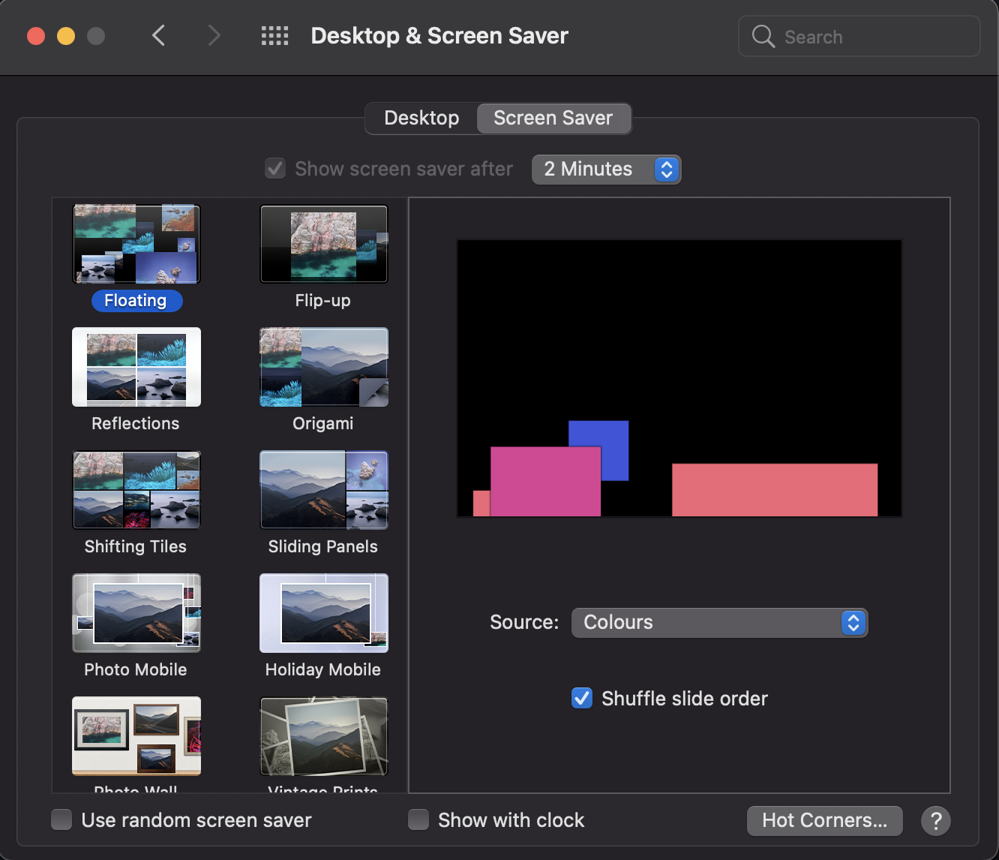

# MacScreenSaverKeepAlive
work-around for when you can't change your mac screen saver time setting



Some times you get a lock on this screen.\
In the case of the computer where this screenshot was taken, it meant that the screen saver would trigger every 2 minutes.\
the only work around would be to keep the mouse moving.

This script basically moves the mouse 1 pixel every 110 seconds, just 10 seconds before the screen saver kicks in.

## Requirements

* brew
* python3
* pyautogui

## Installation

```
$ /bin/bash -c "$(curl -fsSL https://raw.githubusercontent.com/Homebrew/install/HEAD/install.sh)"
$ brew install python
$ pip install pyautogui
```

## Usage

Just run the following command:

```
$ python3 screen_saver_keep_alive.py
```

You can exit at any time with `CTRL + C`
